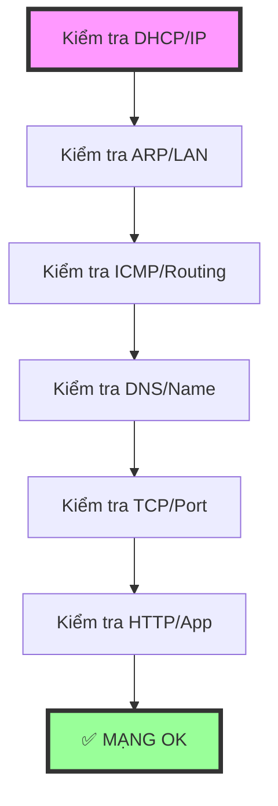

# BÀI 4.2: LAB 01 – HIỂU MẠNG TỪ DƯỚI LÊN (NHƯ ĐI LÀM THẬT)

## 🎯 Mục tiêu Lab này
- Biết máy có mạng hay không.
- Biết nó chết ở bước nào.
- Biết dùng lệnh gì để chứng minh.

---

## PHẦN 1 – “TAO LÀ AI? TAO ĐANG Ở ĐÂU?” (Checking IP & DHCP)

### 🔹 Bước 1: Kiểm tra IP
```bash
ip addr
```
👉 Bạn phải trả lời được:
1.  **Interface chính tên gì?** (ví dụ: `ens33`, `eth0`)
2.  **Có IP dạng 192.168.x.x hay 10.x.x.x không?**

❌ **Kết luận**: Nếu không có IP → **DHCP chết** → dừng luôn.

### 🔹 Bước 2: Kiểm tra Default Gateway
```bash
ip route
```
Bạn cần thấy dòng tương tự:
```
default via 192.168.x.1 dev ens33
```
❌ **Kết luận**: Không có dòng `default via` → ra khỏi LAN không được.

---

## PHẦN 2 – ARP: “MÀY BIẾT GỬI CHO AI CHƯA?” (Checking LAN L2)

### 🔹 Bước 3: Xem bảng ARP
```bash
ip neigh
```
Bạn sẽ thấy dạng:
```bash
192.168.x.1 dev ens33 lladdr aa:bb:cc:dd:ee:ff REACHABLE
```
👉 **Kết luận**: Nếu trống → chưa nói chuyện với ai trong LAN.

### 🔹 Bước 4: Bắt ARP thật
**Terminal 1:**
```bash
sudo tcpdump -i ens33 -nn arp
```
**Terminal 2:**
```bash
ping -c 1 8.8.8.8
```
👉 **Kết quả mong đợi**: Bạn PHẢI THẤY gói tin hỏi MAC của Gateway:
```
who-has 192.168.x.1 tell 192.168.x.y
```
❌ **Kết luận**: Không thấy ARP → card mạng / bridge / switch ảo lỗi.

---

## PHẦN 3 – ICMP: “IP CÓ ĐI ĐƯỢC KHÔNG?” (Checking L3)

### 🔹 Bước 5: Ping Gateway
```bash
ping -c 3 192.168.x.1
```
❌ **Fail** → LAN chết (Dây đứt, Switch hỏng).

### 🔹 Bước 6: Ping Internet (IP thuần)
```bash
ping -c 3 8.8.8.8
```
❌ **Fail** → Routing / Firewall / NAT lỗi.

### 🔹 Bước 7: Bắt ICMP
```bash
sudo tcpdump -i ens33 -nn icmp
```
Bạn phải thấy cặp đôi: `echo request` và `echo reply`.

---

## PHẦN 4 – DNS: “MÀY CÓ BIẾT TÊN TAO KHÔNG?”

### 🔹 Bước 8: Kiểm tra DNS Config
```bash
cat /etc/resolv.conf
```
Phải có dòng: `nameserver x.x.x.x` (Ví dụ 8.8.8.8 hoặc 1.1.1.1).

### 🔹 Bước 9: Test DNS Lookup
```bash
nslookup google.com
```
❌ **Fail** → DNS chết, không phải Internet chết.

### 🔹 Bước 10: Bắt gói tin DNS
```bash
sudo tcpdump -i ens33 -nn port 53
```

---

## PHẦN 5 – TCP: “BẮT TAY CÓ ĐƯỢC KHÔNG?” (Checking L4)

### 🔹 Bước 11: Test TCP Port
```bash
nc -vz google.com 443
```
👉 **Kết quả**:
- `succeeded` → TCP OK (Thông đường).
- `timeout` → Firewall chặn hoặc Routing sai.

### 🔹 Bước 12: Bắt gói tin TCP Handshake
```bash
sudo tcpdump -i ens33 -nn tcp port 443
```
Bạn phải thấy đủ bộ 3 gói tin Bắt tay 3 bước:
1.  **SYN**
2.  **SYN, ACK**
3.  **ACK**

---

## PHẦN 6 – HTTP: “ỨNG DỤNG CÓ CHẠY KHÔNG?” (Checking L7)

```bash
curl -I https://google.com
```
👉 Đây là tầng cuối cùng (Application). Nếu lệnh này chạy ra kết quả `HTTP/2 200` thì mạng hoàn hảo.

---

## 🏁 TỔNG KẾT LAB 01 (RẤT QUAN TRỌNG)

Bạn vừa đi đúng quy trình debug mạng "chuẩn chỉ" ngoài đời:



❌ **Nguyên tắc vàng**: Fail ở bước nào thì tìm lỗi ở bước đó. **KHÔNG NHÌN LÊN CÁC BƯỚC TRÊN NỮA**.
